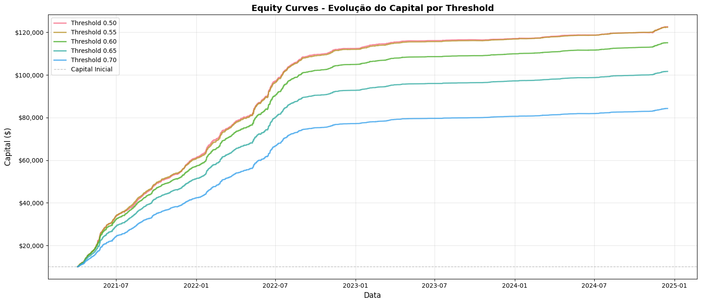
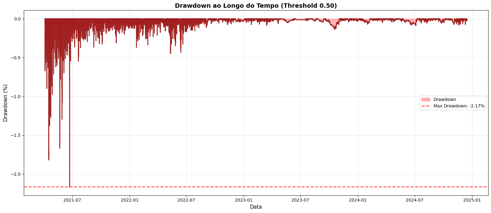
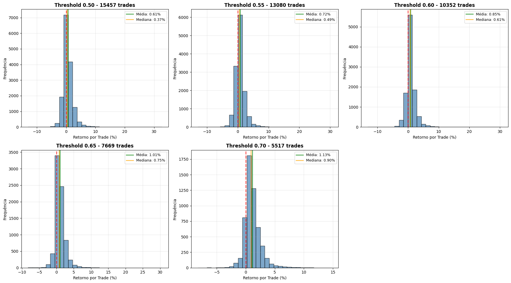
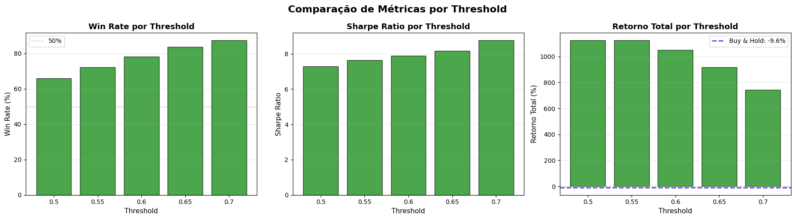

# Quant-Predictor

Sistema de predição de movimentos de criptomoedas usando Machine Learning, com foco em classificação binária (Take Profit vs Stop Loss) baseada em targets adaptativos calculados por ATR.

## Performance Atual (Threshold 0.55)

| Métrica | Valor | Status |
|---------|-------|--------|
| **AUC-ROC** | 0.7730 | Bom |
| **Acurácia** | 72.18% | Bom |
| **Precisão (TP)** | 57.04% | Bom |
| **Recall (TP)** | 57.02% | Moderado |
| **F1-Score** | 0.5703 | Moderado |
| **MCC** | 0.3647 | Positivo |

**Por que threshold 0.55?** Oferece melhor precisão (+6.17 p.p. vs 0.50) com trade-off aceitável no recall, reduzindo falsos positivos em 36.9%.

---

## Estrutura do Projeto

```
quant-predictor/
├── notebooks/                      # Notebooks de análise e desenvolvimento
│   ├── 05_predictor.ipynb          # Faz predições
│   └── old/                        # Arquivos antigos (obsoleto)
│
├── models/                         # Modelos treinados e metadados
│   ├── xgboost_atr_target.pkl      # Modelo pickle
│   ├── xgboost_atr_target.json     # Modelo JSON
│   ├── xgboost_atr_target_metadata.json  # Metadados completos do modelo
│   └── xgboost_atr_target_feature_importance.csv  # Importâncias das features
│
├── config/                         # Arquivos de configuração
│   ├── model_config.json           # Hiperparâmetros e configurações do modelo
│   └── trading_params.json         # Parâmetros de risk management e trading
│
├── docs/                           # Documentação detalhada
│   ├── arquitetura.md              # Arquitetura e pipeline de ML
│   ├── features.md                 # Documentação das ~92 features
│   └── resultados.md               # Resultados e histórico de modelos
│
└── README.md                       
```

---

## Pipeline de Machine Learning

### Coleta de Dados
* **Fonte:** API de exchange de criptomoedas
* **Storage:** Delta Lake (Databricks)
* **Pares:** 9 criptomoedas (BTC, ETH, BNB, SOL, XRP, ADA, AVAX, LINK, NEAR)
* **Timeframe principal:** 1h
* **Período:** 5 anos de dados históricos

### Feature Engineering
* **~92 features** (52 originais + 40 do Lote 1) divididas em 6 categorias:
  - Price features (returns, volatility, z-scores, Bollinger Bands, VWAP, support/resistance)
  - Volume features (volume changes, ratios, z-scores, OBV)
  - Technical indicators (RSI, ATR, momentum, ROC, ADX, volatility ratio)
  - Price action (body/shadow ratios - candle psychology)
  - Temporal features (hour of day - sin/cos encoding)
  - Correlation features (beta com BTC/ETH, relative strength, ratios, market breadth)
* **Multi-timeframe:** 1h (operacional), 15m (tático), 4h (estratégico)
* **Target adaptativo:** Baseado em ATR (2x TP, 1x SL, horizonte 24h)

### Modelagem
* **Algoritmo:** XGBoost (Gradient Boosting)
* **Balanceamento:** scale_pos_weight (class weights automático)
* **Validação:** Split temporal walk-forward (sem data leakage)
* **Otimização:** Early stopping + AUC-ROC
* **Features mais importantes:** `log_return_4h`, `roc_10_1h`, `momentum_1h`, `momentum_4h`, `body_range_ratio_4h`

### Avaliação
* **Métricas principais:** AUC-ROC, Acurácia, Precisão, Recall, F1-Score, MCC
* **Test set:** 20% mais recente (16,426 registros após limpeza)
* **Threshold recomendado:** 0.55 (otimizado para qualidade dos sinais)
* **Monitoramento:** Feature importance + confusion matrix

---

## Início

### Usar modelo em produção
```python
import pickle
import pandas as pd

# Carregar modelo
model_path = 'models/xgboost_atr_target.pkl'
with open(model_path, 'rb') as f:
    model = pickle.load(f)

# Fazer predição
features = pd.DataFrame([...])  # suas features
probability = model.predict_proba(features)[:, 1]

# Aplicar threshold recomendado
threshold = 0.55
prediction = (probability >= threshold).astype(int)

print(f"Probabilidade TP: {probability[0]:.2%}")
print(f"Predição: {'TP' if prediction[0] == 1 else 'SL'}")
print(f"Confiança: {'Alta' if abs(probability[0] - 0.5) > 0.15 else 'Moderada'}")
```

### Verificar metadados do modelo
```python
import json

# Carregar metadados
with open('models/xgboost_atr_target_metadata.json', 'r') as f:
    metadata = json.load(f)

print(f"Data do treino: {metadata['training_date']}")
print(f"AUC-ROC: {metadata['performance']['auc_roc']:.4f}")
print(f"Features: {metadata['n_features']}")
```

---

## Resultados e Insights

### Principais Conquistas
* **AUC-ROC 0.773:** 55% melhor que baseline aleatório (0.5)
* **Acurácia 72.2%:** Modelo acerta mais de 7 em 10 predições
* **Precisão 57.0%:** Dos sinais de TP, 57% estão corretos
* **Multi-timeframe efetivo:** Features de 1h, 15m e 4h contribuem
* **~92 features:** Lote 1 adicionou 40 features com alta relevância preditiva
* **Threshold otimizado:** 0.55 oferece melhor balanço qualidade vs quantidade

### Feature Importance (Top 10)

| Feature                | Importância | Lote         | Descrição                                              |
|------------------------|-------------|--------------|--------------------------------------------------------|
| log_return_4h          | 6.0%        | Lote inicial | Retorno logarítmico 4h continua sendo o fator mais crítico |
| roc_10_1h              | 5.2%        | Lote 1       | Rate of Change 10 períodos (novo no Lote 1)           |
| momentum_1h            | 4.8%        | Lote inicial | Momentum de curto prazo (velocidade do movimento)      |
| momentum_4h            | 3.8%        | Lote inicial | Momentum estratégico (tendência de médio prazo)        |
| body_range_ratio_4h    | 3.3%        | Lote 1       | Força do movimento em 4h (candle psychology)           |
| upper_shadow_ratio_4h  | 3.0%        | Lote 1       | Rejeição na máxima 4h (pressão vendedora)              |
| log_return_1h          | 2.6%        | Lote inicial | Retorno logarítmico operacional                        |
| z_score_close_1h       | 2.4%        | Lote inicial | Normalização do preço 1h (desvio da média)             |
| bb_position_4h         | 2.2%        | Lote inicial | Posição nas Bollinger Bands 4h                         |
| roc_5_1h               | 2.2%        | Lote 1       | Rate of Change 5 períodos (curto prazo)                |

### Insights Principais

#### 1. ROC e Momentum Dominam
* ROC (Rate of Change) aparece 5 vezes no top 30
* `roc_10_1h` é a 2ª feature mais importante
* Velocidade de mudança em múltiplas janelas é altamente preditiva

#### 2. Price Action/Candle Psychology Funciona
* `body_range_ratio_4h` (#5) e `upper_shadow_ratio_4h` (#6) no top 10
* Anatomia dos candles captura psicologia do mercado
* Rejeições (shadows) indicam pressão compradora/vendedora

#### 3. Timeframe 4h Continua Supremo
* `log_return_4h` continua sendo a feature #1
* Features de 4h capturam tendências de médio prazo
* Menor ruído que 1h e 15m

#### 4. Padrões Temporais São Relevantes
* `hour_cos_1h` (#12) e `hour_sin_1h` (#15) no top 15
* Horários de maior liquidez (NY, Ásia, Europa) impactam
* Codificação cíclica preserva natureza circular do tempo

#### 5. Support/Resistance Técnico Funciona
* `support_break_1h` (#16), `resistance_break_1h` (#18)
* Breakouts de níveis técnicos são preditivos
* VWAP distance (#19) também é relevante

#### 6. Visualizações

##### Equity Curves - Evolução do Capital



**Observações:**
* Crescimento consistente de 2021 a 2025
* Threshold 0.50 (vermelho) apresentou o maior crescimento final
* Thresholds mais conservadores tiveram crescimento mais suave mas steady
* Período de maior crescimento: 2021-2022 (bull market)
* Estabilização após 2023 com crescimento linear moderado

##### Drawdown Analysis


**Observações:**
* **Max Drawdown:** -2.17% em 22/06/2021
* Drawdowns geralmente de curta duração (recuperação rápida)
* Drawdown controlado mesmo durante bear market 2022-2023
* Perfil de risco muito favorável considerando o retorno obtido

### Distribuição de Retornos



**Observações:**
* Distribuição aproximadamente normal centrada em valores positivos
* Cauda direita (ganhos) mais longa que cauda esquerda (perdas)
* Presença de outliers positivos (trades excepcionais de +20-30%)
* Stop Loss efetivo em limitar perdas extremas

### Comparação de Métricas



**Insights:**
* **Win Rate:** Aumenta consistentemente com threshold mais alto
* **Sharpe Ratio:** Melhora com thresholds mais conservadores
* **Retorno Total:** Inversamente proporcional ao threshold
* Todos os thresholds superaram significativamente o Buy & Hold

### Próximos Passos
- [x] **Threshold optimization** - Validado threshold 0.55 como superior
- [ ] **Otimização de hiperparâmetros** (Optuna/GridSearch)
- [ ] **Ensemble de modelos** (XGBoost + LightGBM + CatBoost)
- [ ] **Walk-forward validation** mais robusta (múltiplos folds)
- [ ] **Lote 2:** Sentiment (funding rate, OI, long/short ratio)
- [ ] **Lote 2:** Order book (spread, depth, imbalance)
- [ ] **Lote 2:** On-chain metrics (active addresses, exchange flows, MVRV)
- [ ] **Integração:** API de inferência em produção
- [ ] **Monitoring:** Drift detection + retraining automático

---

## Documentação Completa

* **[Arquitetura](docs/arquitetura.md)** - Estrutura do projeto e pipeline de ML
* **[Features](docs/features.md)** - Documentação das ~92 features
* **[Resultados](docs/resultados.md)** - Performance e histórico de modelos
* **[Configurações](config/)** - Parâmetros de modelo e trading

---

## Uso do Modelo

### Threshold: Qualidade vs Quantidade

O modelo suporta thresholds customizados. **Recomendamos 0.55** como padrão:

| Threshold | Precisão | Recall | Quando Usar |
|-----------|----------|--------|-------------|
| **0.55** | 57.04% | 57.02% | **Recomendado** - Melhor balanço qualidade/quantidade |
| 0.50 | 50.87% | 70.51% | Perfil agressivo - Quer capturar mais oportunidades |
| 0.60 | ~65%* | ~45%* | Perfil conservador - Prioriza alta precisão |

*Estimado baseado na curva precision-recall

### Interpretação das Predições

#### Com Threshold 0.55 (Recomendado)
* **≥ 0.55:** Sinal de TP - Probabilidade 57% de acerto
* **< 0.55:** Sinal de SL - Evitar entrada

#### Níveis de Confiança
* **> 0.65:** Alta confiança de TP - sinal forte de entrada
* **0.55 - 0.65:** Confiança moderada de TP - sinal válido
* **0.45 - 0.55:** Zona cinza - evitar (indecisão)
* **< 0.45:** Alta confiança de SL - sinal forte contra entrada

### Exemplo de Uso com Threshold

```python
# Fazer predição
probability = model.predict_proba(features)[:, 1]

# Threshold recomendado
threshold = 0.55
prediction = (probability >= threshold).astype(int)

# Classificar confiança
if probability[0] >= 0.65:
    confidence = "Alta"
elif probability[0] >= 0.55:
    confidence = "Moderada"
elif probability[0] >= 0.45:
    confidence = "Baixa - Zona cinza"
else:
    confidence = "SL esperado"

print(f"Probabilidade: {probability[0]:.2%}")
print(f"Predição: {'TP' if prediction[0] == 1 else 'SL'}")
print(f"Confiança: {confidence}")

# Exemplo de saída:
# Probabilidade: 62.34%
# Predição: TP
# Confiança: Moderada
```

### Por que Threshold 0.55?

**Vantagens:**
* Precisão 6.17 p.p. melhor que 0.50 (50.87% → 57.04%)
* Reduz falsos positivos em 36.9%
* Acurácia geral 3.77 p.p. melhor (68.41% → 72.18%)
* Win rate mais realista e confiável

**Trade-offs:**
* ⚠️ Recall 13.49 p.p. menor (70.51% → 57.02%)
* ⚠️ Perde ~13% das oportunidades reais
* ⚠️ 27.9% menos sinais emitidos

**Use threshold 0.50 se:**
* Tem capital amplo para diversificar
* Prefere quantidade sobre qualidade
* Custos de transação são baixos
* Perfil agressivo / risk-seeking

**Use threshold 0.60+ se:**
* Capital muito limitado
* Custos de transação altos
* Perfil extremamente conservador
* Só quer sinais de altíssima confiança

### Limitações e Considerações

* Modelo treinou com horizonte de 24h - não use para day trading
* Precisão de 57% com threshold 0.55 (43% de falsos positivos)
* Sempre use stop loss e take profit conforme ATR
* Backtest em produção antes de usar dinheiro real
* Modelo pode degradar com mudanças de regime de mercado
* Threshold pode ser ajustado conforme seu perfil de risco
